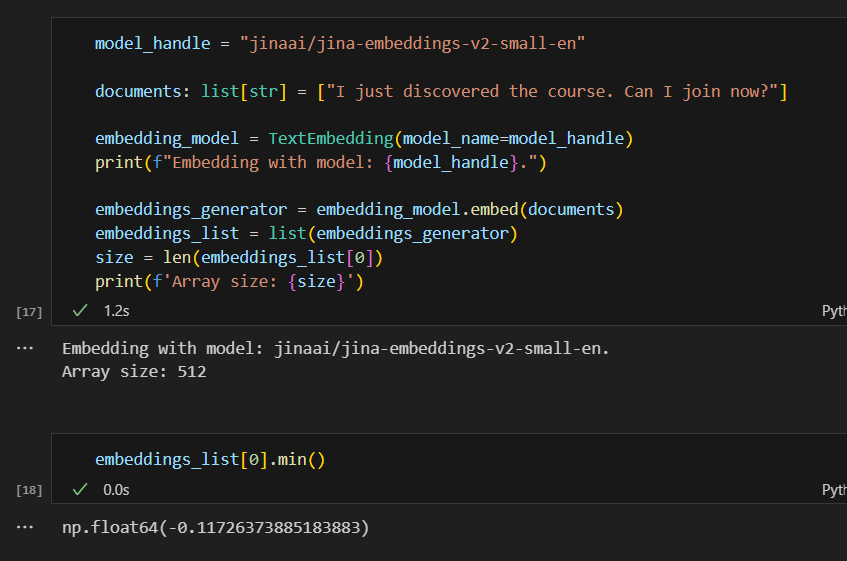
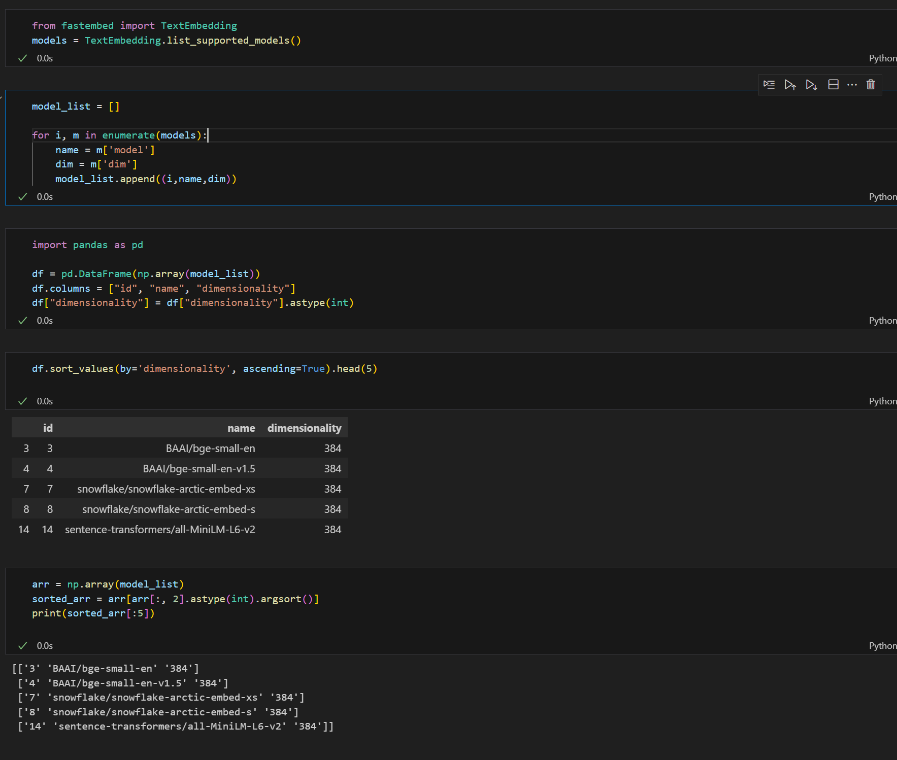

# Q1. Embedding the query

What's the minimal value in this array?

* -0.51
* -0.11
* 0
* 0.51

## Q1. Solution

* -0.11

# Q2. Cosine similarity with another vector

What's the cosine similarity between the vector for the query and the vector for the document?

* 0.3
* 0.5
* 0.7
* 0.9

## Q2. Solution

* 0.9

# Q3. Ranking by cosine

What's the document index with the highest similarity? (Indexing starts from 0):

* 0
* 1
* 2
* 3
* 4

## Q3. Solution

* 1

# Q4. Ranking by cosine, version two

Embed this field and compute the cosine between it and the query vector. What's the highest scoring document?

* 0
* 1
* 2
* 3
* 4

## Q4. Solution

* 0

# Q5. Selecting the embedding model

Now let's select a smaller embedding model. What's the smallest dimensionality for models in fastembed?

* 128
* 256
* 384
* 512

## Q5. Solution

* 384

