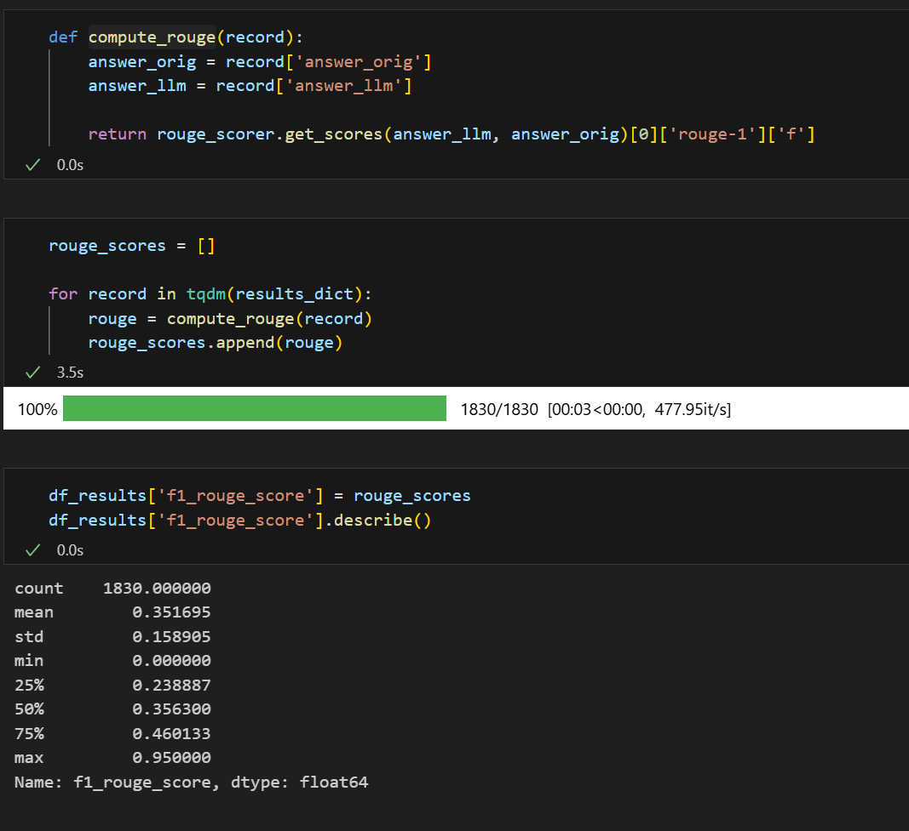

# Homework

## Q1. Minsearch text

What's the hitrate for this approach?

* 0.64
* 0.74
* 0.84
* 0.94

### Q1. Solution

* 0.84

## Q2. Vector search for question

Evaluate this seach method. What's MRR for it?

- 0.25
- 0.35
- 0.45
- 0.55

### Q2. Solution

- 0.35

## Q3. Vector search for question and answer

Using the same pipeline (`min_df=3` for TF-IDF vectorizer and `n_components=128` for SVD), evaluate the performance of this
approach

What's the hitrate?

- 0.62
- 0.72
- 0.82
- 0.92

### Q3. Solution

- 0.82

## Q4. Qdrant

What's the MRR?

- 0.65
- 0.75
- 0.85
- 0.95

### Q4. Solution

- 0.85

## Q5. Cosine simiarity

What's the average cosine?

- 0.64
- 0.74
- 0.84
- 0.94

### Q5. Solution

- 0.84

## Q6. Rouge

Let's compute it for the pairs in the entire dataframe.
What's the average Rouge-1 F1?

- 0.25
- 0.35
- 0.45
- 0.55

### Q6. Solution

- 0.35

