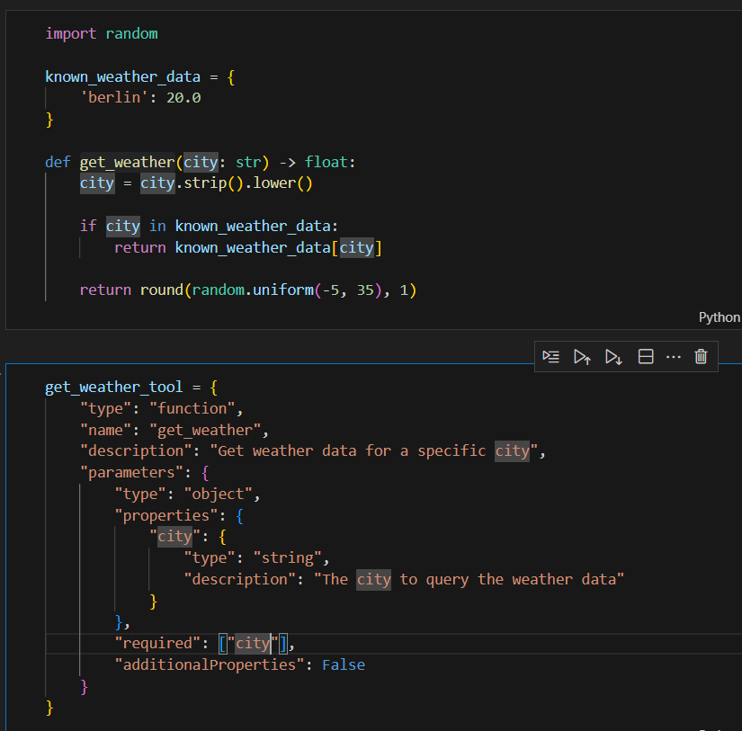
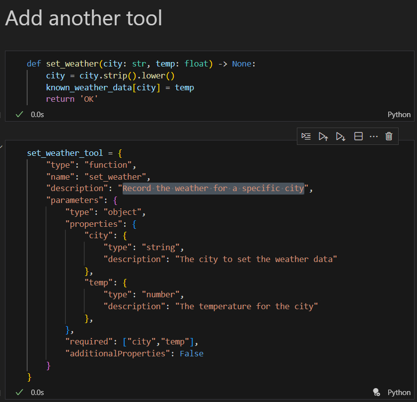
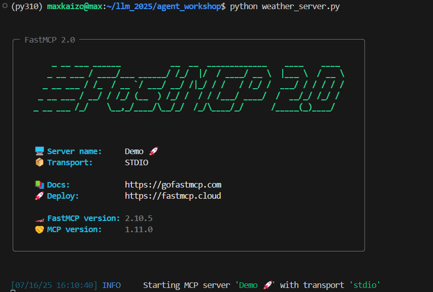
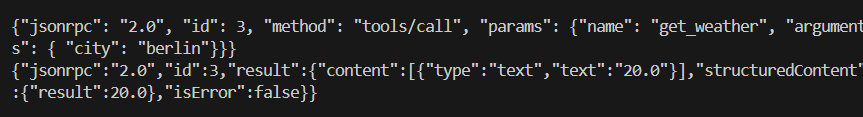
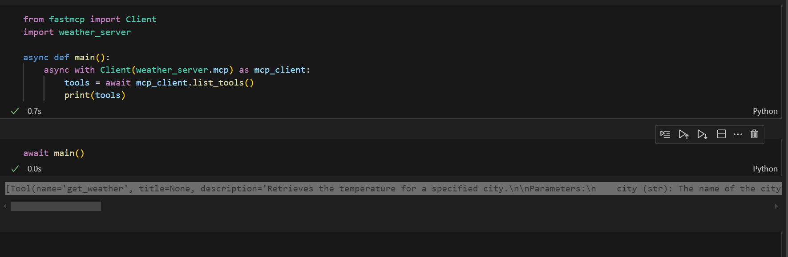
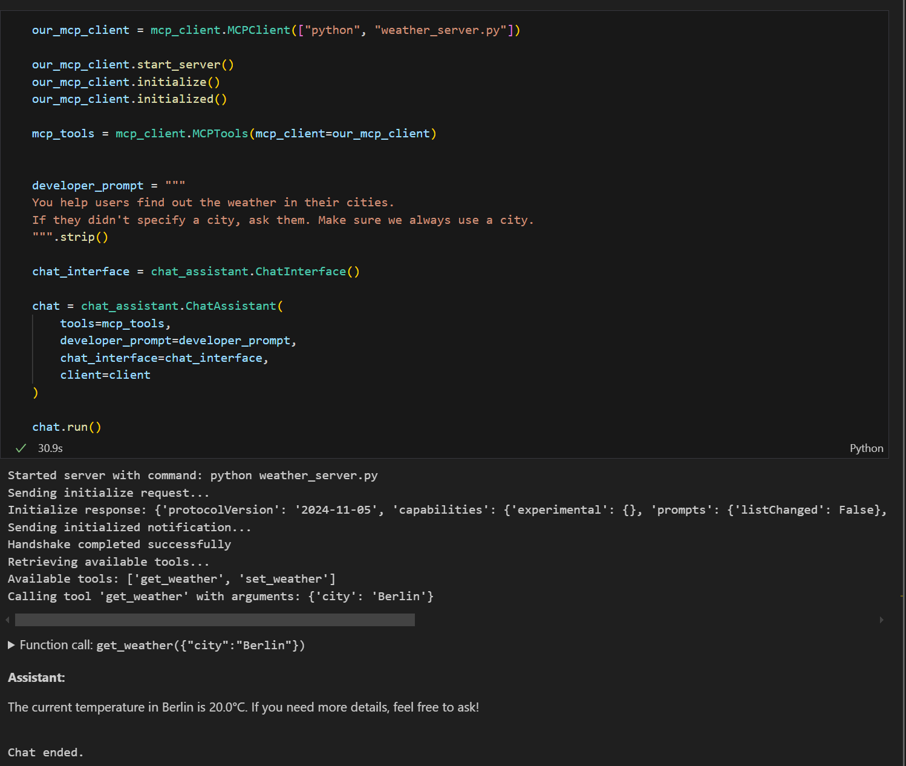

# Homework: Agents

## Q1. Define function description

* What did you put in TODO3?

### Q1. Solution

* city

## Q2. Adding another tool

* What did you write?

### Q2. Solution 

* Record the weather for a specific city

## Q3 Install FastMCP

* What's the version of FastMCP you installed?

### Q3. Solution

* 2.10.5

## Q4. Simple MCP Server

* What do you see in the output?

### Q4. Solution

* stdio

## Q5. Protocol

* What did you get in response?

### Q5. Solution

* {"jsonrpc":"2.0","id":3,"result":{"content":[{"type":"text","text":"20.0"}],"structuredContent":{"result":20.0},"isError":false}}

## Q6. Client

* Copy the output with the available tools when filling in the homework form.

### Q6. Solution

* [Tool(name='get_weather', title=None, description='Retrieves the temperature for a specified city.\n\nParameters:\n    city (str): The name of the city for which to retrieve weather data.\n\nReturns:\n    float: The temperature associated with the city.', inputSchema={'properties': {'city': {'title': 'City', 'type': 'string'}}, 'required': ['city'], 'type': 'object'}, outputSchema={'properties': {'result': {'title': 'Result', 'type': 'number'}}, 'required': ['result'], 'title': '_WrappedResult', 'type': 'object', 'x-fastmcp-wrap-result': True}, annotations=None, meta=None), Tool(name='set_weather', title=None, description="Sets the temperature for a specified city.\n\nParameters:\n    city (str): The name of the city for which to set the weather data.\n    temp (float): The temperature to associate with the city.\n\nReturns:\n    str: A confirmation string 'OK' indicating successful update.", inputSchema={'properties': {'city': {'title': 'City', 'type': 'string'}, 'temp': {'title': 'Temp', 'type': 'number'}}, 'required': ['city', 'temp'], 'type': 'object'}, outputSchema={'properties': {'result': {'title': 'Result', 'type': 'string'}}, 'required': ['result'], 'title': '_WrappedResult', 'type': 'object', 'x-fastmcp-wrap-result': True}, annotations=None, meta=None)]

## Optional

