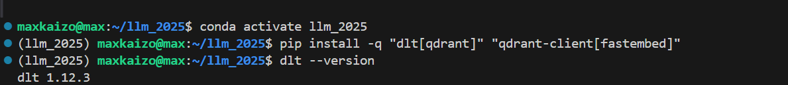
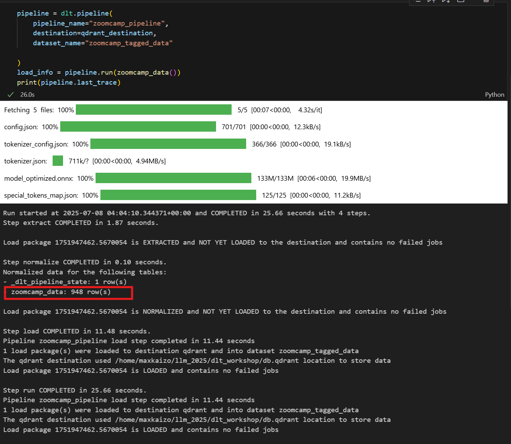
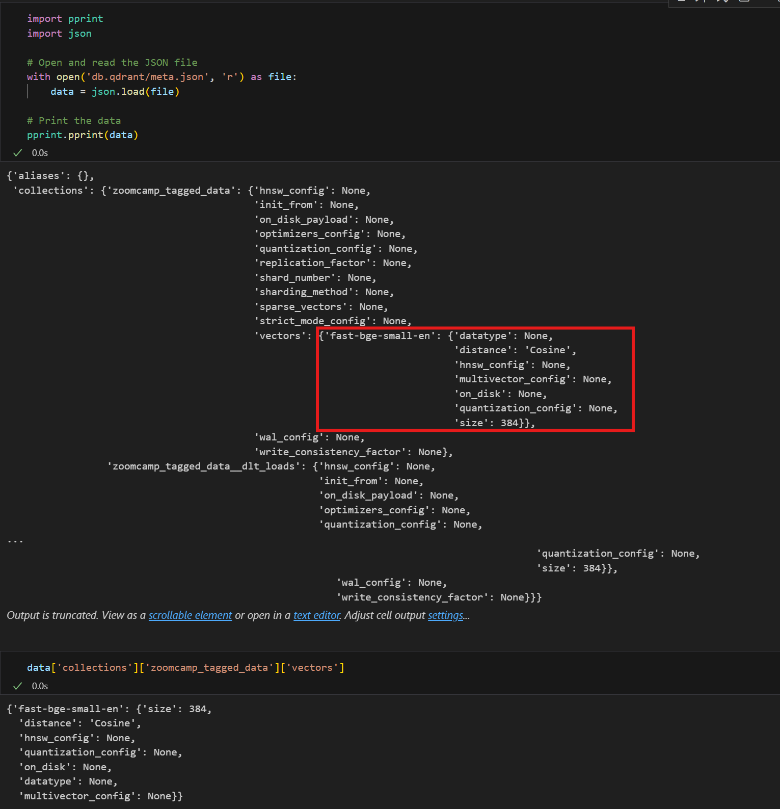

# Question 1. dlt Version

* What's the version of dlt that you installed?

## Q1. Solution

* dlt 1.12.3

# Question 2. dlt pipeline

* How many rows were inserted into the zoomcamp_data collection?

* 948 rows

## Q2. Solution

# Question 3. Embeddings

* When inserting the data, an embedding model was used. Which one?

## Q3. Solution

* fast-bge-small-en

